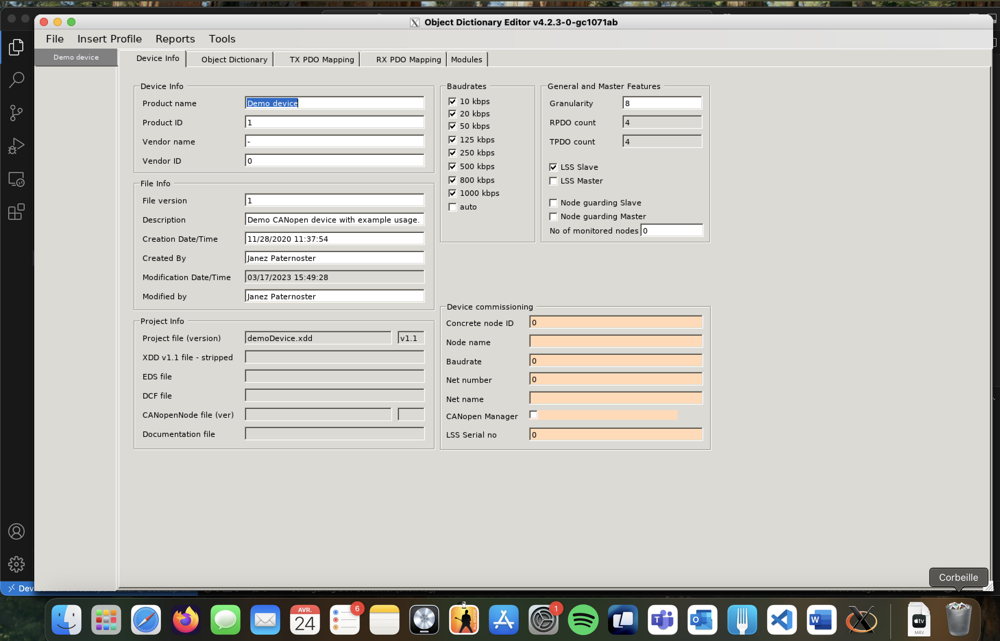
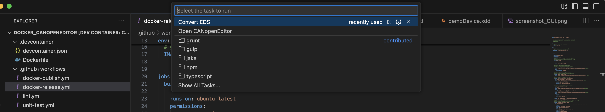

# Docker CANopenEditor

[](https://github.com/RomainPelletant/docker_canopeneditor/actions/workflows/docker-publish.yml)

This repository provides a Docker image bundling [CANopenEditor](https://github.com/CANopenNode/CANopenEditor), a GUI tool for editing CANopen EDS and DCF files.
Integration in VSCode is provided inside DevContainer if you are not confident with docker commands.

It provides a way to run CANopenEditor on all platforms (Linux, MacOS, Windows) with mono, including the GUI via x11 for development or CI purpose.



- Supported architectures:
linux/amd64, linux/arm64

## Registry

Container registry is available [here](https://github.com/RomainPelletant/docker_canopeneditor/pkgs/container/docker_canopeneditor)

## Requirements

- Docker (or similar)
- VSCode with devcontainer extension installed (optional)
- x11 client (XQuartz for MacOS for example)

## Getting started (without VSCode & devcontainer)

1. Pull the docker image
```shell
docker pull ghcr.io/romainpelletant/docker_canopeneditor:latest
```
2. Run docker image
```shell
docker run --rm -it -e DISPLAY=host.docker.internal:0 -v /tmp/.X11-unix:/tmp/.X11-unix ghcr.io/romainpelletant/docker_canopeneditor:latest
```
3. Launch CANopenEditor GUI or CLI
```shell
EDSEditor
```
```shell
EDSSharp
```
For more information, please refer to the dedicated section [How to use (CLI)](#how-to-use-cli)

## Getting started in VSCode & devcontainer

⚠️ Ensure devcontainer extension is installed in VSCode
1. Clone this repository
2. Open the repository folder in VSCode (open folder)
3. Click on "Reopen in devcontainer"
4. Cmd + MAJ + P
5. Run The GUI (EDSEditor) or the conversion tasks (EDSSharp)



## Tested

- MacOS (XQuartz as x11 client) / Apple silicon & Intel
- Linux (Ubuntu 24.04)

## License

This project is licensed under the MIT License. See the LICENSE file for details.
Note: This Docker image contains canopeneditor, which is licensed under the GNU General Public License v3 (GPLv3). You can find its source code and license here:
https://github.com/CANopenNode/CANopenEditor

No modifications have been made to canopeneditor in this image.

## Sample

demoDevice.eds and demoDevice.xdd are present for test purpose

### How to use (GUI)

Open the folder inside VSCode and open with DevContainer.
Or manually:

```shell
# Inside the container
EDSEditor
```

### How to use (CLI)

```shell
# Inside the container
EDSSharp --infile <eds_or_xdd_file> --outfile <output_filenam> --type <type_selected>
```
Example:
```shell
# Inside the container
EDSSharp --infile demoDevice.xdd --outfile OD --type CanOpenNodeV4
```

Exporter types:
  - ElectronicDataSheet [.eds]
  - DeviceConfigurationFile [.dcf]
  - CanOpenNode [.h,.c]
  - CanOpenNodeV4 [.h,.c]
  - CanOpenXDDv1.0 [.xdd]
  - CanOpenNetworkv1.0 [.nxdd]
  - CanOpenXDDv1.1 [.xdd]
  - CanOpenXDDv1.1stripped [.xdd]
  - CanOpenXDCv1.1 [.xdc]
  - CanOpenNetworkXDDv1.1 [.nxdd]
  - CanOpenNetworkXDCv1.1 [.nxdc]
  - CanOpenNodeProtobuf(json) [.json]
  - CanOpenNodeProtobuf(binary) [.binpb]
  - DocumentationHTML [.html]
  - DocumentationMarkup [.md]
  - NetworkPDOReport [.md]
